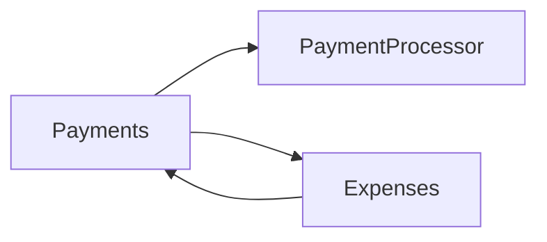
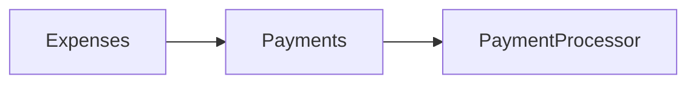
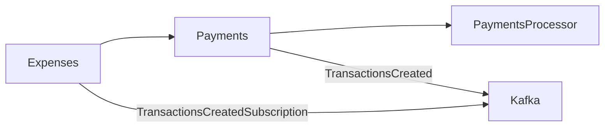

# Loosely Coupled Phoenix Contexts

# Introduction

Anybody who has worked with Elixir Phoenix in the past few years will likely be aware of something called "Contexts". I won't go into the detail of what contexts are in this guide, and recommend reading [https://hexdocs.pm/phoenix/contexts.html](https://hexdocs.pm/phoenix/contexts.html) to get information into what contexts are. However at a base level, contexts take a leaf out of the domain driven development guide, and propose grouping code by related functionality. I also will not go into too much depth about why domain driven development is good idea in this guide, there are several resources out there to explain this, however at a base level if done correctly, it can lead to easy to reason about code, that is loosely coupled and maps directly to the business domain.

However, there are situations that arise when developing code this way that can lead to problems, and specifically highly coupled code which can lead to difficulties in maintainance, and also performance issues in some circumstances, in this post I will try and give an explanation of this problem, and how to mitigate against it.

## Company Expenses

I find that is always best to give concrete examples to illustrate a problem and solution, and to do this I will take the area I personally work in, which is FinTech, specifically company/employee expenses. 

At a basic level, companies likely have employees who make expenses which often have to be paid by the company. Historically this has been done using a shared card, of the employee paying with their own money and being reimbursed in their next payslip. This isn't a great experience, so in this example system, we want to a system where companies can be created, along with card holders (employees) and expenses can be stored. And the expenses can either be set as a company expense, or personal expense based on what the purchase was.

To illustrate this example i have created a project called "PayStation" which you can see here [https://github.com/MikeyBower93/pay_station](https://github.com/MikeyBower93/pay_station). 

## PayStation Architecture

In this example, the architecture can be formalised as 2 Phoenix Contexts which are as follows:
1. "Payments" context, this is a context responsible for anything payment related, in this case its specifically about transactions, and our system being aware of transactions occurring from a payment processor (some external system). This context, should not, and does not have awareness of employees or expenses as its out of its domain, if we were to couple these we would be breaking domain driven design, and if the payments context ever needed to deal with other types of payments that aren't expenses, we would struggle or have to make large changes as it would be coupled to employee expenses.
2. "Expenses" context, the expenses context is the group logic relating the company expenses, specifically "Companies" -> "Card holders (employees)" -> "Expenses", whereby employees make expenses on behalf of a company, and an expense can be set as a personal expense or company expense when it is reviewed. 

## Whats the Problem?

The major problem here is how we keep this cohesive. As we now know the "Payments" context gets transactions from a payment processor and parses them into our system, however this means we need to create expenses off the back of these transactions. However its a bad design decision to have the "Payments" context call the "Expenses" context for the reasons explained earlier. It is not a problem for "Expenses" to call "Payments", becauses "Expenses" implies transactions, but "Payments" do not imply expenses. If we ended up coupling these context the following would happen:



As seen above, we can see that there is tight coupling between the payments and expenses contexts, however what we desire is this:



How can we solve this since we need to be aware of transactions being created in the "Payments" context within the "Expenses" context?.

## Message Queues

A great way is solving this using message queues which uses the "Publish Subscribe" pattern. In so far as the "Payments" context can publish when a transaction has occurred, and other contexts can subscribe to that event, without creating coupling within the "Payments" context. This way if our business cases change or extend in the future, we can easily adapt this by creating additional subscribers etc without touching the "Payments" domain, which in many ways gives us the OCP principle (open closed).

**But what Queue?** 

There are no hard a fast rules on what queue you should use. In the example project I use kafka, however others are available such as RabbitMQ, Google PubSub etc. However I would highly recommend using an "at least" once queue, this means that it tracks if a consumer has processed a message or not and mantains offsets for this, this is great because it means your system will not miss messages. 

One of the reasons I point this out is you might think "could I use the PubSub mechanism built into Phoenix?". Whilst you could do this, and you would achieve the same desired effect from a design perspective, it might not be the most robust way. Mainly because it is an "at most once" system, which means if your system crashes when processing messages, it will not continue processing those messages when it recovers which could be very bad.

**How does this look?**

The repo will give you the full picture of how this works, however here are some key highlights, starting with the architecture.



**Payments Context**

As you can see in the repo we have a "Payments" folder within the "pay_station" directory. This groups all "Payments" based context logic. We have created a "fake" `PaymentProcessor` as follows:

```elixir
defmodule PayStation.Payments.External.PaymentProcessor do
  alias PayStation.Payments.External.Transaction

  def fetch_payments do
    0..Faker.random_between(0, 100)
    |> Enum.map(fn _seed ->
        %Transaction{
          id: Faker.UUID.v4(),
          quantity: Faker.random_between(0, 1_000_000),
          card_id: Faker.random_between(1, 10),
          merchant: Faker.Company.name
        }
    end)
  end
end
```

This is used to simulate the creation of payments, imagine this being an external payments processor.

We then have a "GenServer" which runs on a 10 second schedule to fetch outstanding payments made, when it retrieves these, it parses them, and puts them on the kafka queue, the bulk of this can be seen in this function:

```elixir
  @impl true
  def handle_info(:work, state) do
    transactions =
      PaymentProcessor.fetch_payments()
      |> Enum.map(fn transaction -> {transaction.id, Jason.encode!(transaction)} end)

    Kaffe.Producer.produce_sync("transactions_created", transactions)

    # Reschedule once more
    schedule_work()

    {:noreply, state}
  end
```

**Expenses Context**

Similar to the Payments context we can see we have an "expenses" folder which groups the related expenses logic. In this we have a few ecto models representing companies, card holders and expenses. However we also have an "expenses_processor" which receives the kafka messages as follows:

```elixir

  def handle_messages(messages) do
    new_expenses =
      messages
      |> Enum.map(& &1.value)
      |> Enum.map(& Jason.decode!(&1, as: %Transaction{}))
      |> Enum.map(fn transaction ->
        %{
          transaction_id: Map.get(transaction, "id"),
          quantity:  Map.get(transaction, "quantity"),
          merchant:  Map.get(transaction, "merchant"),
          card_holder_id:  Map.get(transaction, "card_id"),
          inserted_at: NaiveDateTime.utc_now() |> NaiveDateTime.truncate(:second),
          updated_at: NaiveDateTime.utc_now() |> NaiveDateTime.truncate(:second)
        }
      end)

    Repo.insert_all(Expense, new_expenses)

    :ok
  end
```

This is done using `kaffe` and the initialisation can be seen in `config.ex`. This receives kafka messages for the transactions whenever they are created via the kafka message queue. This means we can process transactions without creating Payments context coupling.

Finally to demonstrate the logic further, we have an `expenses_controller.ex` which allows expenses to be fetched for a company etc, and also be reviewed by somebody, this is done without any coupling to the "Payment" context.

## Final Notes

Firstly, I want to point out that this is quite a crude example used to demonstrate a business case using contexts, and how to use a message queue to solve coupling issues. This by no case means its production ready code, to make this production ready you would need to take into account several things such as:
- Dead letter queues, for if messages failed to be processed.
- Idempotency, as you could end up consuming messages more than once, you need to ensure you deal with this fact using things like "upserts".
- Proper configuration of kafka, with the right partitions etc.
- Tests of course!

Finally, I want to acknowledge and point out that of course including a fully fledged message queue such as kafka creates an overhead of infrastructure maintainance. Although this is getting easier with managed services, to the point where you can even use kafka in `heroku` now, its important for you to balanace the complexity of the project, vs the need for such tools. However its important to note that, Phoenix is often considered a break away from the microservice pattern to a monolith pattern, this is for 2 reasons, one is due to its roots in the ruby community and the "Majestic Monolith" pattern, but also because of the sheer performance cababilities of elixir with OTP. Whilst this is understandable, its important for us to learn from the microservice patterns and what they solve, as it can apply to elixir monoliths aswell as we have just seen. Using something like kafka also means if you did choose to split your elixir services, you will still retain the benefits as it can be used for cross service communication.

Happy coding!